# AWS Event-Driven Application

## Project Overview

This project demonstrates a **serverless event-driven application** built on AWS using Terraform.

The application enables users to:
- Send requests through API Gateway
- Ingest and store request data in DynamoDB using the Ingestor Lambda
- Process events asynchronously using Amazon SQS
- Trigger Lambda functions for ingestion and processing
- Update processed data in DynamoDB using the Processor Lambda
- Receive notifications via Amazon SNS

The system follows an event-driven architecture where services communicate through events, ensuring scalability, fault tolerance, and decoupled processing.

---

## AWS Services Used

The following AWS services are used in this project:

### Compute
- AWS Lambda → Executes ingestion and processing logic

### API Layer
- Amazon API Gateway → Exposes API endpoints

### Messaging & Event Processing
- Amazon SQS → Queues messages for asynchronous processing
- Amazon SNS → Sends notifications to subscribers

### Database
- Amazon DynamoDB → Stores submitted requests and updated processing status

### Monitoring
- Amazon CloudWatch → Logs and monitoring

### Security & Access
- AWS IAM → Provides Lambda execution role, CloudWatch logging access, and permissions for SQS, DynamoDB, and SNS

### Infrastructure
- Terraform → Infrastructure as Code (IaC)
- AWS CLI → Configuration and deployment support

---

## Architecture Diagram

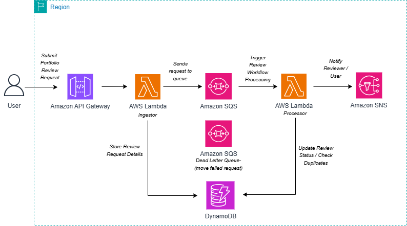

## Architecture Overview

This project follows an **event-driven architecture** on AWS.

### Architecture Components

- API Gateway → Entry point for incoming requests
- Ingestor Lambda → Validates requests, stores initial record in DynamoDB, and sends messages to SQS
- Amazon DynamoDB → Stores request data and processing status
- Amazon SQS → Message queue for decoupling services
- Processor Lambda → Processes messages from SQS and updates DynamoDB
- Amazon SNS → Sends email notifications

---

## Application Workflow

1. User sends a request via API Gateway

2. API Gateway triggers the Ingestor Lambda function

3. Ingestor Lambda:
   - Validates request data
   - Stores data in DynamoDB with status = "SUBMITTED"
   - Sends message to SQS queue

4. Amazon SQS stores the message

5. SQS triggers the Processor Lambda function

6. Processor Lambda:
   - Processes the message
   - Updates the existing record in DynamoDB (e.g., status update)
   - Sends notification via SNS

7. Amazon SNS sends an email notification to the subscriber

---

## Test Cases

The following test cases were performed to validate the application functionality.

---

### 1. API Gateway Verification

- Verified that the API Gateway endpoint was created successfully and is available to receive requests.

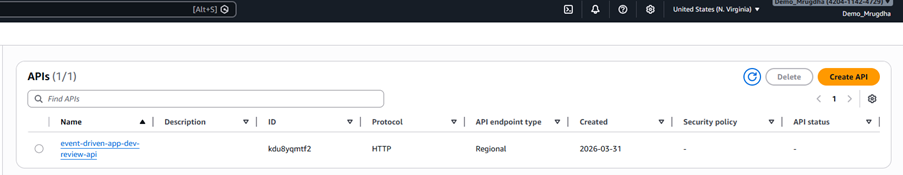

---

### 2. Lambda Function Creation

- Verified that both Lambda functions were created successfully:
  - Ingestor Lambda
  - Processor Lambda

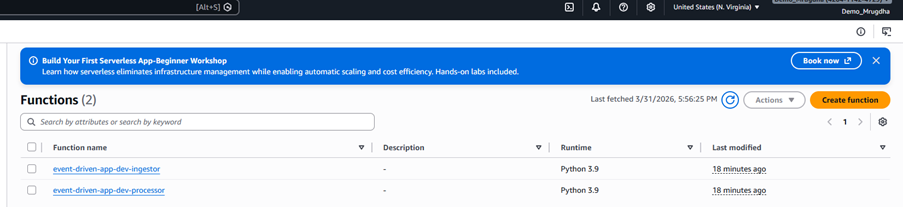

---
### 3. Ingestor Lambda Verification

- Verified that the ingestor Lambda function was configured correctly and triggered through API Gateway.

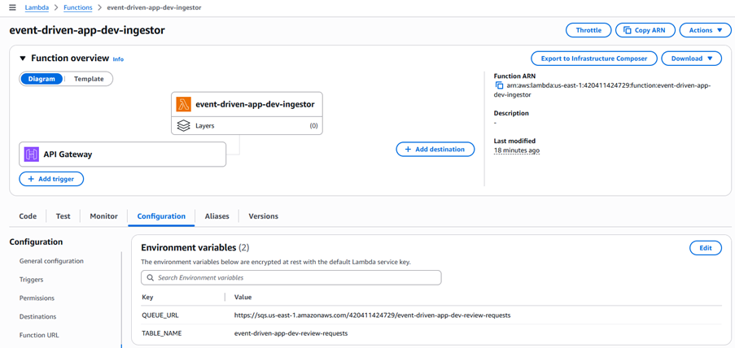

---

### 4. Processor Lambda Verification

- Verified that the processor Lambda function was configured correctly for queue-based processing.

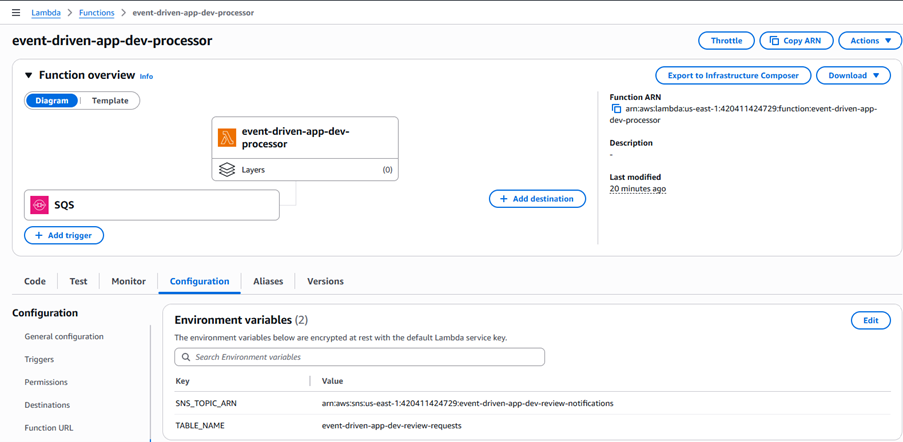

---
### 5. DynamoDB Table Creation

- Verified that the DynamoDB table was created successfully for storing request records and status updates.

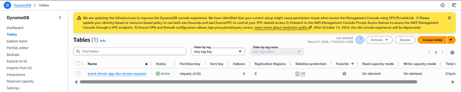

---

### 6. SQS Queue Creation

- Verified that the main SQS queue and the Dead Letter Queue (DLQ) were created successfully.

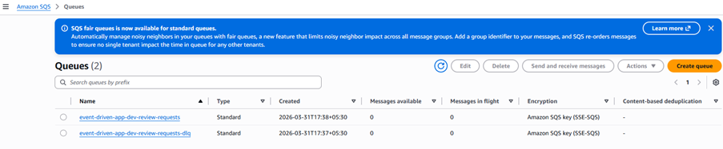

---

### 7. SNS Topic Creation

- Verified that the SNS topic was created successfully for sending email notifications.

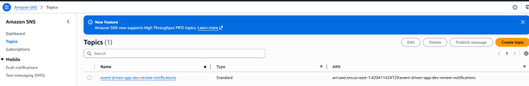

---

### 8. SNS Subscription Creation

- Verified that the email subscription to the SNS topic was created successfully.

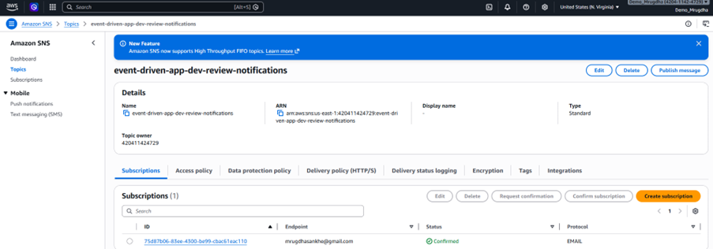

---
### 9. Initial frontend test

- Got Verified output on screen reagrding review request being sucessful.

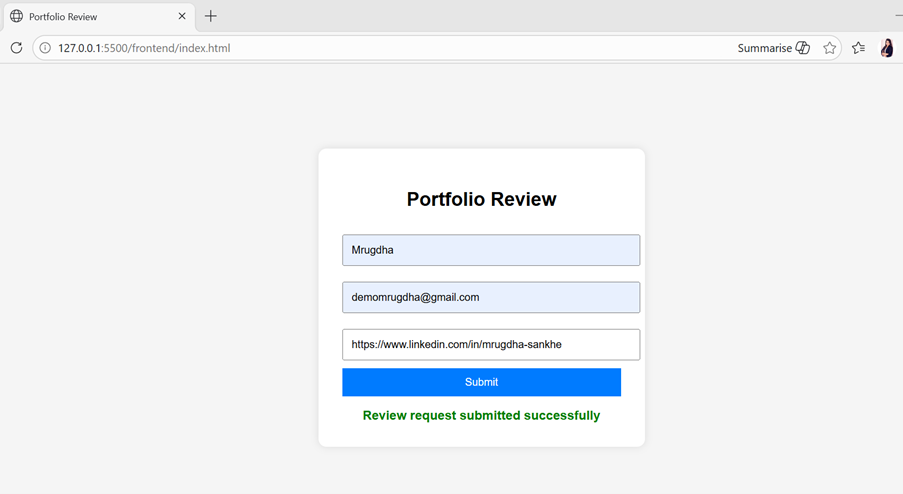

---

### 10. DynamoDB Validation

- Verified that the ingestor Lambda stored the initial record in DynamoDB.

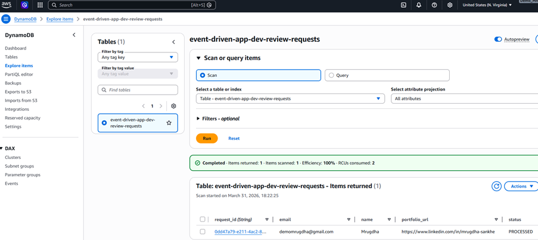

---

### 11. Ingestor Lambda Log Verification

- Opened AWS Console → Lambda → event-driven-app-dev-ingestor → Monitor → View CloudWatch logs
- Verified that the ingestor Lambda executed successfully without errors.

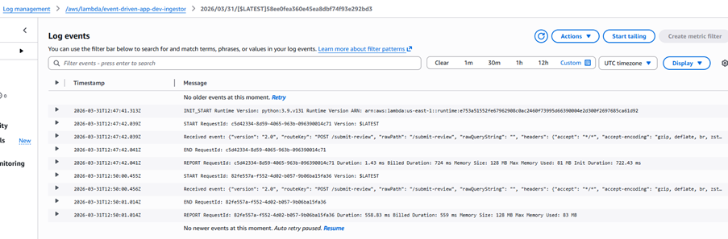

---
### 12. Processor Lambda Log Verification

- Opened AWS Console → Lambda → event-driven-app-dev-processor → Monitor → View CloudWatch logs
- Verified that the processor Lambda executed successfully without errors.

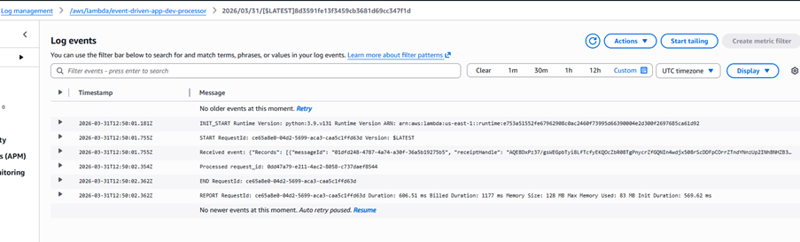

---

### 13. SNS Notification Verification

- Verified that email notification was received successfully as a subscriber.

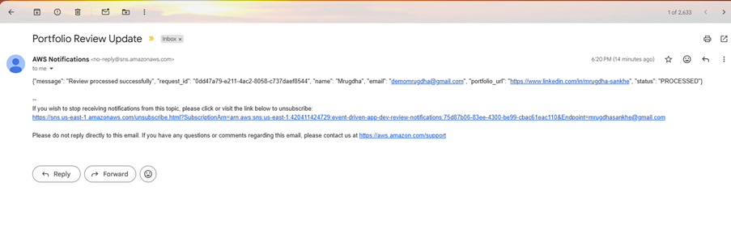

---

## Testing Failures

To test failure scenarios, the processor Lambda was controlled so that queue behavior could be observed more clearly.

### Part 1: How to Make Messages Visible in the Main Queue

To see messages remain in Amazon SQS, the processor Lambda must be stopped from consuming them immediately.

#### Step 1

- Go to **AWS Console → Lambda → event-driven-app-dev-processor**

#### Step 2

- Open **Configuration → Triggers**
- Verify that the SQS trigger is attached

#### Step 3

- Disable the SQS trigger attached to the processor Lambda

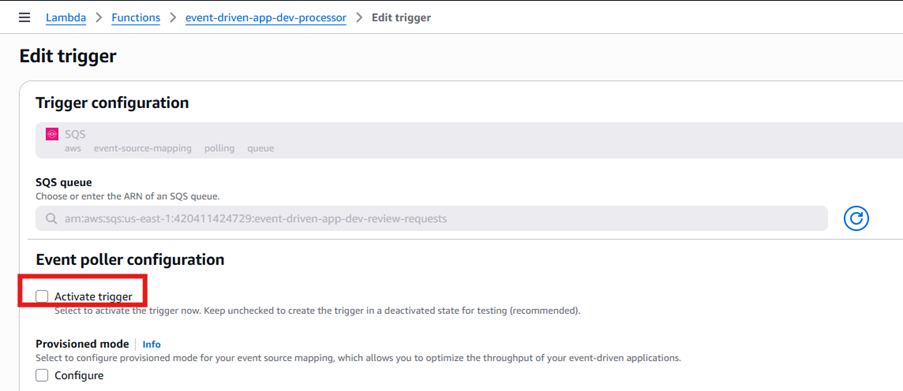

#### Step 4

- Submit the frontend form 2 to 3 times

#### Step 5

- Go to **AWS Console → SQS → event-driven-app-dev-review-requests**
- Verify that messages are now visible in the main queue
- Confirm that the message count increases because the processor Lambda is no longer consuming them

This confirms that:

- Ingestor Lambda is still sending messages to SQS
- Processor Lambda is not consuming messages
- Messages remain available in the main queue for inspection

#### Step 6

- In the SQS queue, click **Send and receive messages**

#### Step 7

- Click **Poll for messages**

This allows the actual messages in the queue to be viewed.

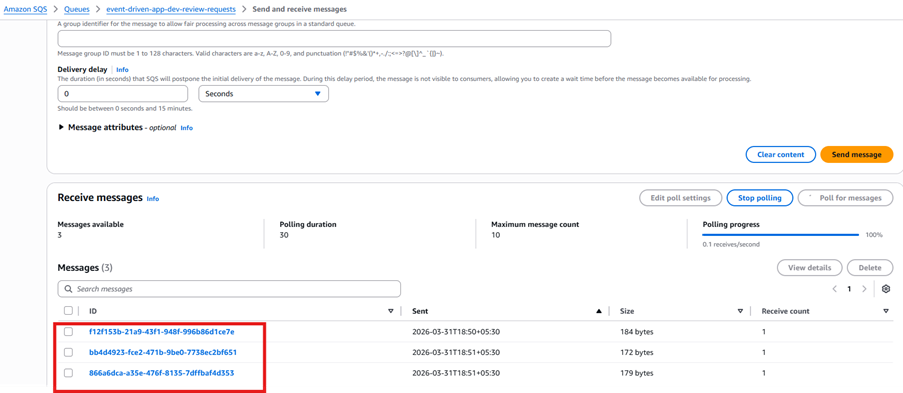

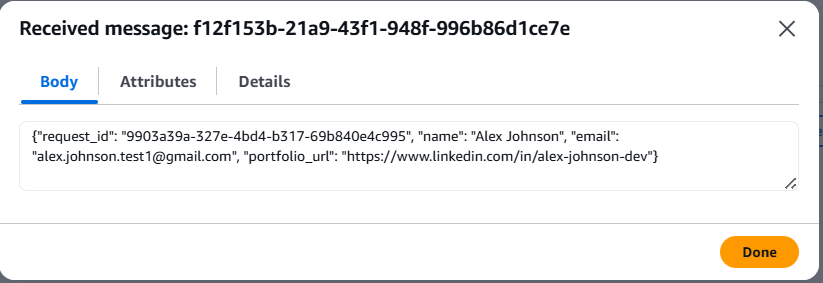

#### Step 8

- After enabling trigger,in millisecond I got notification from amazon sns.

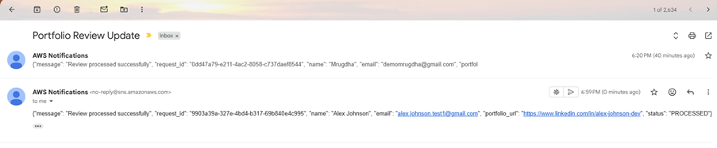

---

### Part 2: How to Force Messages into the DLQ

To test the Dead Letter Queue (DLQ), the processor Lambda was intentionally made to fail.

#### Step 1

- After Re-enabling the SQS trigger on the processor Lambda.

#### Step 2

- Modify the processor Lambda code to force a failure.
- Update the Lambda function to throw an exception so that processing fails intentionally.
- Open lambda/processor/index.py and replace the whole file with this temporary test version:

   > import json

    > def lambda_handler(event, context):
        >print("Received event:", json.dumps(event))
        >raise Exception("Forced failure for DLQ testing")

#### Step 3

- Repackage the updated processor Lambda function.
-    cd lambda\processor
     Compress-Archive -Path .\index.py -DestinationPath .\function.zip -Force

- Deploy the updated function using 'terraform apply'.

#### Step 4

- Submit the frontend form once to trigger the workflow.

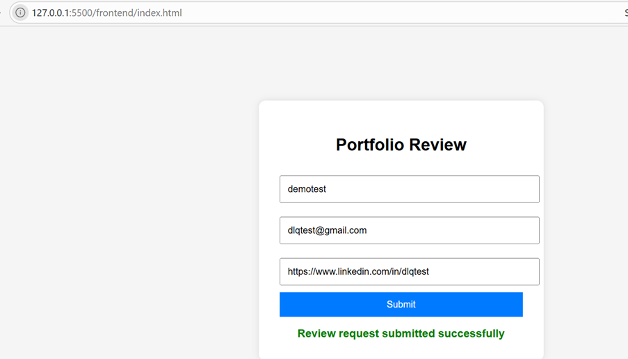

#### Step 5

- Verify the system behavior:

  - Ingestor Lambda sends message to SQS  
  - Processor Lambda is triggered  
  - Processor Lambda fails intentionally  
  - SQS retries the message  
  - After `maxReceiveCount = 3`, the message is moved to the Dead Letter Queue (DLQ)

---

### Part 3: How to Verify DLQ Worked

#### Step 1

- Go to **AWS Console → SQS → Dead Letter Queue (DLQ)**

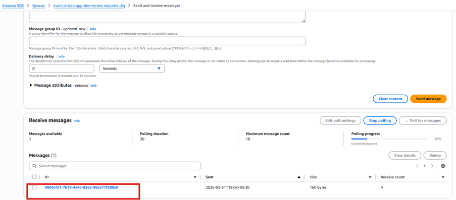

#### Step 2

- Open the DLQ and verify that the failed message is present.
- Confirm that the message was moved to the DLQ after exceeding the maximum retry attempts.

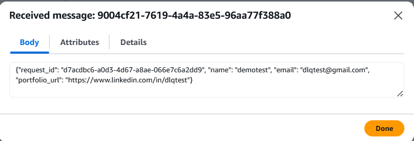

#### Step 3

- Go to **AWS Console → Lambda → event-driven-app-dev-processor → Monitor → View CloudWatch logs**
- Open the latest log stream.

- Verify that:
  - The processor Lambda was triggered  
  - The forced exception error is visible in logs  

This confirms that the message failed processing and was redirected to the DLQ successfully.

---

## Issue faced: Failed to Connect to Server (CORS Error)

#### Error

- Failed to connect to server  

---

#### Root Cause

- The frontend was initially opened using:
   file://
- This caused a browser-origin problem, and the browser blocked API requests.

- The browser console showed the actual issue:
  - CORS error  
  - Origin was null  
  - Preflight request failed  

---
#### Resolution

**Part A — Enable CORS in API Gateway**

- Updated the API configuration in Terraform to include:

   cors_configuration {
   allow_origins = ["*"]
   allow_methods = ["GET", "POST", "OPTIONS"]
   allow_headers = ["content-type"]
   }

---

**Part B — Stop using file://**

- Opened the frontend using Live Server in VS Code:
- Instead of: file:///

- This provided a proper browser origin and allowed API requests to be processed correctly.

---

#### Result

- API requests worked successfully  
- CORS errors were resolved  
- Frontend and backend communication functioned correctly  

---

## Conclusion

This project demonstrates a complete event-driven architecture using AWS, showcasing asynchronous processing, service decoupling, and robust error handling using SQS,DLQ, SNS.

---

## Author

Mrugdha Sankhe
